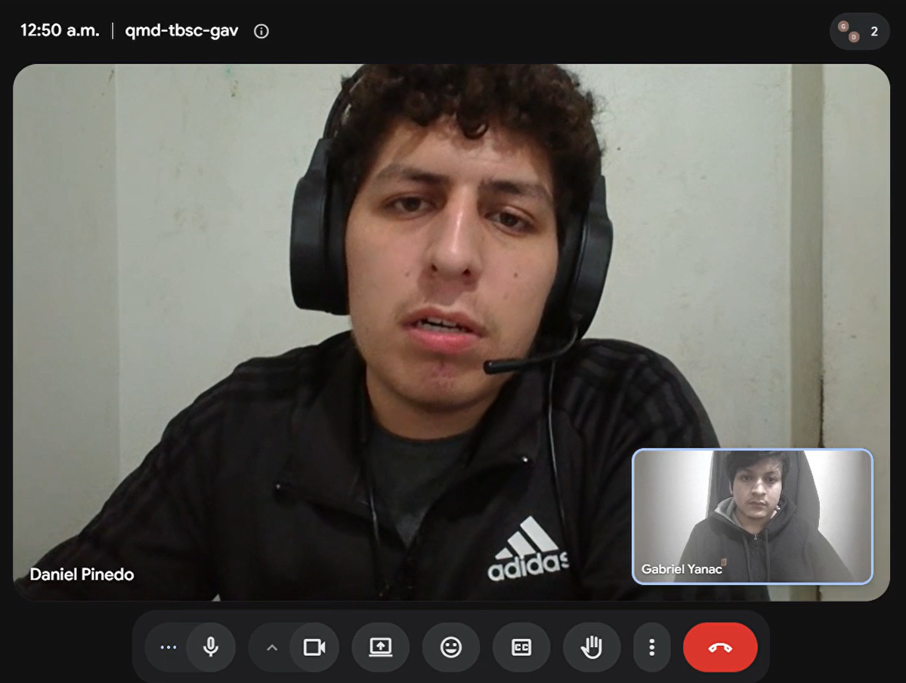

## 2.2 Entrevistas

### 2.2.1 Diseño de entrevistas

Las entrevistas tienen como objetivo recopilar información acerca de las experiencias, necesidades, comportamientos, objetivos y frustraciones de los usuarios pertenecientes a los segmentos objetivo de ParkShare. Asimismo, se busca conocer sus hábitos relacionados con el uso de estacionamientos y servicios digitales, con la finalidad de obtener información que permita desarrollar posteriormente los artefactos de Needfinding.

#### Segmento 1: Conductores en Zonas Urbanas

Para este segmento, la entrevista busca comprender cómo los conductores encuentran actualmente espacios de estacionamiento, qué dificultades experimentan durante este proceso, cuáles son los factores que consideran al seleccionar un espacio y qué herramientas digitales utilizan durante sus desplazamientos.

1. ¿Con qué frecuencia utilizas un automóvil y cuáles suelen ser los principales motivos de tus desplazamientos?

2. Cuéntame sobre la última vez que necesitaste encontrar estacionamiento en una zona urbana concurrida. ¿A dónde ibas y qué ocurrió?

3. Cuando te desplazas hacia una zona donde no tienes estacionamiento asegurado, ¿cómo sueles buscar dónde dejar tu vehículo?

4. ¿Qué dificultades encuentras normalmente durante la búsqueda de estacionamiento?

5. ¿Qué aspectos consideras más importantes al decidir dónde estacionar tu vehículo? ¿Por qué?

6. ¿Cuánto tiempo sueles estar dispuesto a dedicar a buscar estacionamiento antes de considerar otra alternativa?

7. ¿Cómo influye el precio del estacionamiento en tu decisión y cómo determinas cuánto estás dispuesto a pagar?

8. ¿Alguna vez has preferido no ir en automóvil a algún lugar debido a la dificultad para estacionar? Cuéntame qué ocurrió.

9. Si pudieras mejorar algún aspecto de la experiencia actual de buscar y utilizar estacionamientos, ¿qué cambiarías y por qué?

10. ¿Qué aplicaciones o servicios digitales utilizas habitualmente cuando conduces o te desplazas?

11. Cuando necesitas consultar información o realizar una reserva mediante Internet, ¿qué dispositivo y aplicaciones utilizas normalmente?

12. ¿Por qué medios prefieres recibir información importante, como confirmaciones, recordatorios o cambios relacionados con un servicio?

13. ¿Qué información necesitarías conocer sobre un estacionamiento antes de decidir dejar allí tu vehículo?

14. ¿Qué preocupaciones tendrías al estacionar tu vehículo en un espacio perteneciente a una persona o negocio que no conoces? ¿Qué factores aumentarían tu confianza?

#### Segmento 2: Propietarios de Espacios y Negocios

Para este segmento, la entrevista busca comprender cómo los propietarios o responsables administran actualmente sus espacios de estacionamiento, durante qué periodos permanecen disponibles, cuáles serían sus motivaciones para aprovecharlos económicamente y qué preocupaciones tendrían al permitir que terceros los utilicen.

1. Cuéntame sobre el espacio o los espacios de estacionamiento que posees o administras. ¿Dónde se encuentran y cuáles son sus principales características?

2. ¿En qué momentos o días suelen permanecer desocupados esos espacios y aproximadamente durante cuánto tiempo?

3. ¿Cómo se utilizan o gestionan actualmente esos espacios cuando se encuentran disponibles?

4. ¿Alguna vez has permitido, prestado o alquilado alguno de estos espacios a terceros? Cuéntame cómo fue la experiencia.

5. ¿Qué razones podrían motivarte a ofrecer estos espacios a otros conductores durante los periodos en los que están disponibles?

6. ¿Qué preocupaciones o riesgos considerarías antes de permitir que un conductor utilice uno de tus espacios de estacionamiento?

7. ¿Qué información necesitarías conocer sobre un conductor antes de aceptar que utilice uno de tus espacios?

8. ¿Cómo gestionas o gestionarías los horarios de disponibilidad para evitar conflictos con el uso habitual de los espacios?

9. Si decidieras cobrar por el uso temporal de tus espacios, ¿qué factores tomarías en cuenta para establecer el precio?

10. ¿Cómo funciona actualmente el acceso a tus espacios de estacionamiento?

11. ¿Qué situaciones podrían hacer que dejaras de ofrecer temporalmente un espacio, incluso si estuviera desocupado?

12. ¿Qué aplicaciones o servicios digitales utilizas habitualmente para realizar pagos, ventas, alquileres o gestionar otros servicios?

13. ¿Qué dispositivo utilizas principalmente para acceder a servicios digitales y qué medios prefieres para recibir notificaciones o comunicarte con otras personas?

14. ¿Qué tendría que ofrecer un servicio de este tipo para que te sintieras suficientemente seguro y cómodo administrando temporalmente tus espacios de estacionamiento?

### 2.2.2 Registro de entrevistas

En esta sección se presenta el registro de las entrevistas realizadas a representantes de los segmentos objetivo de ParkShare. Para cada entrevistado se recopilan datos generales, evidencia audiovisual y un resumen descriptivo de la información obtenida durante la sesión.

#### Segmento 2: Propietarios de Espacios y Negocios

#### Entrevista 1

| Dato                | Información                                      |
| ------------------- | ------------------------------------------------ |
| Nombres y apellidos | Daniel Pinedo                                    |
| Edad                | 21                                               |
| Distrito            | Ventanilla                                       |
| Segmento objetivo   | Propietarios de Espacios y Negocios              |
| Fecha de entrevista | 11/09/2026                                       |
| Duración aproximada | 6 min 54 s                                       |
| Inicio en el video  | 00:01                                            |
| URL del video       | https://youtu.be/DHeAJ3CKvXE?si=JknAzuz1o0-fJjBQ |

**Evidencia de la entrevista**

**Resumen de la entrevista**

Daniel Pinedo pertenece al segmento de Propietarios de Espacios y Negocios. Actualmente cuenta con una cochera ubicada dentro de su vivienda, con capacidad para un automóvil. El espacio es techado, se encuentra separado de la parte principal de la casa y su acceso se realiza desde la calle mediante un portón operado con control remoto.

Respecto al uso del espacio, indicó que la cochera permanece desocupada durante una parte considerable de la semana. El automóvil familiar es utilizado principalmente por su padre para acudir al trabajo y, durante ciertos periodos del día y también algunos fines de semana, la cochera permanece vacía. Cuando esto sucede, generalmente el espacio no recibe ningún uso adicional, aunque ocasionalmente puede ser utilizado temporalmente por algún familiar.

El entrevistado señaló que hasta el momento solo ha permitido utilizar la cochera a familiares o personas conocidas en quienes tiene confianza. No ha realizado un alquiler formal del espacio. Sin embargo, considera que la posibilidad de generar ingresos adicionales mediante un espacio que normalmente permanece desocupado sería una motivación importante para ofrecerlo temporalmente a otros conductores.

En relación con sus principales preocupaciones, mencionó especialmente la seguridad. Permitir el ingreso de una persona desconocida a su propiedad le generaría preocupación debido a la posibilidad de daños dentro del inmueble o de que ocurra algún inconveniente relacionado con el vehículo. Por esta razón, considera importante poder conocer previamente información del conductor.

Entre los datos que considera necesarios se encuentran el nombre de la persona, algún documento de identificación como el DNI y datos del vehículo, especialmente la placa. También manifestó interés en contar con un sistema de calificaciones para los conductores, ya que las experiencias registradas por otros propietarios podrían ayudarle a evaluar qué tan confiable resulta una persona antes de permitirle utilizar el espacio.

Respecto a la disponibilidad, considera necesario establecer horarios específicos en los que la cochera pueda ser ofrecida. Como ejemplo, señaló que podría encontrarse disponible aproximadamente de lunes a viernes entre las 9:00 a. m. y las 5:00 p. m., siempre que durante ese periodo su familia no necesite utilizarla.

Para establecer el precio del alquiler, tomaría en consideración las tarifas que cobran otros estacionamientos, el tiempo durante el cual permanecerá el vehículo, la ubicación del espacio y factores relacionados con la seguridad. Esto evidencia que el precio no estaría determinado únicamente por el tiempo de uso, sino también por las características y condiciones del estacionamiento.

En cuanto al acceso, explicó que la cochera cuenta con un portón operado mediante control remoto. Actualmente, para permitir el ingreso de un conductor sería necesario que alguna persona se encontrara dentro de la vivienda para abrirlo. Esta situación representa una posible dificultad operativa para ofrecer el espacio cuando el propietario no se encuentra disponible.

El entrevistado indicó también que podría dejar de ofrecer temporalmente la cochera cuando él o su familia necesiten utilizarla, cuando espere la visita de algún familiar o si llegara a tener experiencias negativas recurrentes con los conductores que hagan uso del espacio.

Respecto a sus hábitos digitales, señaló que utiliza principalmente aplicaciones bancarias como BCP y una billetera digital para realizar pagos. También utiliza WhatsApp como uno de sus principales medios de comunicación. Su dispositivo de uso habitual es el teléfono celular y prefiere recibir información importante mediante notificaciones en el dispositivo o a través de WhatsApp.

Finalmente, considera que para sentirse seguro utilizando una plataforma orientada al alquiler temporal de estacionamientos sería necesario contar con mecanismos de verificación de los conductores, conocer la placa de los vehículos, establecer horarios claramente definidos y recibir confirmaciones relacionadas con las reservas. También considera importante conocer con anticipación posibles cancelaciones y mantener control sobre la disponibilidad del espacio.

### 2.2.3 Análisis de entrevistas
