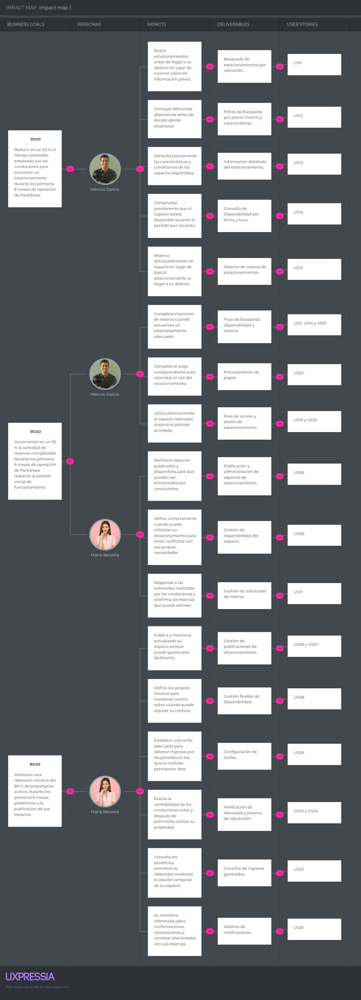

# Capítulo III: Requirements Specification

## 3.1 User Stories

A partir de las necesidades identificadas durante el proceso de investigación y Needfinding, se definieron las siguientes épicas para organizar las funcionalidades principales de ParkShare. Estas épicas abarcan las necesidades de los conductores, propietarios de espacios y visitantes del Landing Page.

### Épicas

Las siguientes épicas agrupan las principales funcionalidades de ParkShare de acuerdo con las necesidades identificadas para los conductores, propietarios de espacios de estacionamiento y visitantes de la plataforma.

| Epic ID | Título                                                    | Descripción                                                                                                                                                                                                                                                              |
| ------- | --------------------------------------------------------- | ------------------------------------------------------------------------------------------------------------------------------------------------------------------------------------------------------------------------------------------------------------------------ |
| EP01    | Gestión de usuarios, identidad y confianza                | Agrupa las funcionalidades relacionadas con el registro, inicio de sesión, gestión de perfiles, registro de vehículos, verificación de identidad y mecanismos orientados a generar confianza entre conductores y propietarios.                                           |
| EP02    | Gestión de espacios de estacionamiento                    | Agrupa las funcionalidades que permiten a los propietarios registrar, publicar, editar y administrar sus espacios de estacionamiento, incluyendo sus características, fotografías, ubicación, disponibilidad y tarifas.                                                  |
| EP03    | Búsqueda y reserva de estacionamientos                    | Agrupa las funcionalidades que permiten a los conductores buscar, filtrar, consultar y reservar espacios de estacionamiento disponibles según su ubicación, fecha, horario, precio y características.                                                                    |
| EP04    | Gestión de reservas, acceso y sesiones de estacionamiento | Agrupa las funcionalidades relacionadas con la administración de reservas, cancelaciones, autorización de acceso al espacio, inicio y finalización de la sesión de estacionamiento y control del uso del espacio reservado.                                              |
| EP05    | Pagos, ingresos, calificaciones y notificaciones          | Agrupa las funcionalidades relacionadas con el pago de reservas, registro y consulta de ingresos de los propietarios, calificaciones entre usuarios y envío de notificaciones sobre eventos importantes de la plataforma.                                                |
| EP06    | Landing Page y comunicación del servicio                  | Agrupa las funcionalidades del sitio web público orientadas a informar a los visitantes sobre ParkShare, comunicar la propuesta de valor para ambos segmentos, presentar las principales características del servicio y dirigir a los usuarios hacia la Web Application. |

### User Stories

A partir de las épicas previamente definidas y de las necesidades identificadas durante el proceso de investigación, se establecieron las siguientes User Stories para ParkShare. Estas historias representan las principales funcionalidades requeridas por conductores, propietarios de espacios de estacionamiento, visitantes del Landing Page y desarrolladores responsables de la integración con el RESTful API.

| Story ID | Título                                                 | Descripción                                                                                                                                                                                            | Criterios de Aceptación                                                                                                                                                                                                                                                                                                                                                                                                                                                                                                                                                                                                    | Epic ID |
| -------- | ------------------------------------------------------ | ------------------------------------------------------------------------------------------------------------------------------------------------------------------------------------------------------ | -------------------------------------------------------------------------------------------------------------------------------------------------------------------------------------------------------------------------------------------------------------------------------------------------------------------------------------------------------------------------------------------------------------------------------------------------------------------------------------------------------------------------------------------------------------------------------------------------------------------------- | ------- |
| US01     | Registro de usuario                                    | Como usuario nuevo, deseo crear una cuenta indicando mi tipo de usuario, para poder acceder a las funcionalidades correspondientes de ParkShare.                                                       | **Escenario 1: Registro válido** **Dado** que el usuario no posee una cuenta y proporciona información válida **Cuando** solicita registrarse indicando su tipo de usuario **Entonces** el sistema registra su cuenta y almacena el rol seleccionado.  **Escenario 2: Datos ya registrados** **Dado** que existe una cuenta asociada a los datos proporcionados **Cuando** el usuario intenta registrarse nuevamente **Entonces** el sistema rechaza el registro e informa que los datos ya se encuentran asociados a una cuenta.                                                                  | EP01    |
| US02     | Inicio de sesión                                       | Como usuario registrado, deseo iniciar sesión con mis credenciales, para acceder de forma segura a mi cuenta y funcionalidades.                                                                        | **Escenario 1: Credenciales válidas** **Dado** que el usuario posee una cuenta registrada **Cuando** proporciona credenciales válidas **Entonces** el sistema autentica al usuario y permite el acceso a su cuenta.  **Escenario 2: Credenciales incorrectas** **Dado** que el usuario intenta autenticarse **Cuando** proporciona credenciales incorrectas **Entonces** el sistema rechaza la autenticación e informa que las credenciales no son válidas.                                                                                                                                        | EP01    |
| US03     | Verificación de identidad                              | Como usuario de ParkShare, deseo verificar mi identidad, para generar mayor confianza al interactuar con otros usuarios de la plataforma.                                                              | **Escenario 1: Verificación satisfactoria** **Dado** que el usuario proporciona la información requerida para validar su identidad **Cuando** la información es verificada correctamente **Entonces** el sistema registra al usuario como verificado.  **Escenario 2: Verificación rechazada** **Dado** que el usuario solicita verificar su identidad **Cuando** la información proporcionada no puede ser validada **Entonces** el sistema mantiene la identidad como no verificada e informa el resultado de la validación.                                                                     | EP01    |
| US04     | Registro de vehículo                                   | Como conductor, deseo registrar los datos de mi vehículo, para utilizarlo al realizar reservas de espacios de estacionamiento.                                                                         | **Escenario 1: Vehículo válido** **Dado** que el conductor posee una cuenta activa **Cuando** registra los datos válidos de un vehículo **Entonces** el sistema asocia el vehículo con su perfil.  **Escenario 2: Datos inválidos** **Dado** que el conductor intenta registrar un vehículo **Cuando** proporciona información incompleta o inválida **Entonces** el sistema rechaza el registro del vehículo e informa los datos que deben corregirse.                                                                                                                                            | EP01    |
| US05     | Servicio API de usuarios e identidad                   | Como Developer, deseo disponer de servicios RESTful para gestionar usuarios, perfiles e identidad, para integrar estas funcionalidades con los clientes de ParkShare.                                  | **Escenario 1: Request válido** **Dado** que un cliente autorizado envía una solicitud válida al servicio **Cuando** el API procesa la operación solicitada **Entonces** devuelve una respuesta exitosa con los datos correspondientes.  **Escenario 2: Request inválido** **Dado** que el API recibe datos inválidos o incompletos **Cuando** procesa la solicitud **Entonces** devuelve una respuesta de error indicando la causa correspondiente.                                                                                                                                               | EP01    |
| US06     | Publicación de espacio de estacionamiento              | Como propietario, deseo registrar y publicar un espacio de estacionamiento, para ofrecerlo temporalmente a conductores interesados.                                                                    | **Escenario 1: Publicación válida** **Dado** que el propietario posee un espacio disponible y proporciona la información requerida **Cuando** registra el espacio **Entonces** el sistema crea la publicación asociada al propietario.  **Escenario 2: Información incompleta** **Dado** que el propietario intenta registrar un espacio **Cuando** falta información obligatoria **Entonces** el sistema no publica el espacio e informa qué información debe completarse.                                                                                                                        | EP02    |
| US07     | Edición de espacio publicado                           | Como propietario, deseo modificar la información de mis espacios publicados, para mantener actualizados sus datos y características.                                                                   | **Escenario 1: Actualización válida** **Dado** que el propietario posee una publicación existente **Cuando** modifica información válida del espacio **Entonces** el sistema actualiza los datos de la publicación.  **Escenario 2: Espacio no perteneciente al propietario** **Dado** que un propietario intenta modificar una publicación ajena **Cuando** solicita guardar los cambios **Entonces** el sistema rechaza la operación y mantiene la información existente.                                                                                                                        | EP02    |
| US08     | Configuración de disponibilidad                        | Como propietario, deseo establecer los días y horarios en los que mi espacio está disponible, para evitar conflictos con mi propio uso del estacionamiento.                                            | **Escenario 1: Horario disponible** **Dado** que el propietario posee un espacio publicado **Cuando** establece un periodo de disponibilidad válido **Entonces** el sistema registra el periodo como disponible para reservas.  **Escenario 2: Conflicto con reserva existente** **Dado** que existe una reserva confirmada en determinado periodo **Cuando** el propietario intenta marcar ese mismo periodo como no disponible **Entonces** el sistema mantiene la reserva existente e informa el conflicto.                                                                                     | EP02    |
| US09     | Configuración de tarifa                                | Como propietario, deseo establecer la tarifa de uso de mi espacio, para determinar cuánto cobraré por las reservas realizadas.                                                                         | **Escenario 1: Tarifa válida** **Dado** que el propietario administra un espacio publicado **Cuando** establece una tarifa válida **Entonces** el sistema registra la tarifa para futuras reservas.  **Escenario 2: Tarifa inválida** **Dado** que el propietario configura una tarifa **Cuando** el valor no cumple las reglas establecidas **Entonces** el sistema rechaza la tarifa e informa que debe ingresar un valor válido.                                                                                                                                                                | EP02    |
| US10     | Servicio API de espacios de estacionamiento            | Como Developer, deseo disponer de servicios RESTful para registrar, consultar y actualizar espacios de estacionamiento, para integrar su gestión con la Web Application.                               | **Escenario 1: Operación válida** **Dado** que el API recibe una solicitud autorizada con datos válidos **Cuando** procesa una operación sobre un espacio **Entonces** devuelve una respuesta exitosa con la información actualizada.  **Escenario 2: Operación no válida** **Dado** que la solicitud contiene datos inválidos o no cuenta con autorización suficiente **Cuando** el API procesa la solicitud **Entonces** devuelve el código de error correspondiente sin modificar el recurso.                                                                                                   | EP02    |
| US11     | Búsqueda de estacionamientos por ubicación             | Como conductor, deseo buscar espacios de estacionamiento cercanos a mi destino, para reducir el tiempo dedicado a encontrar dónde estacionar.                                                          | **Escenario 1: Existen espacios disponibles** **Dado** que el conductor indica una ubicación y periodo requerido **Cuando** realiza la búsqueda **Entonces** el sistema proporciona los espacios disponibles próximos a la ubicación indicada.  **Escenario 2: No existen espacios disponibles** **Dado** que el conductor realiza una búsqueda **Cuando** no existen espacios que cumplan las condiciones solicitadas **Entonces** el sistema informa que no se encontraron espacios disponibles.                                                                                                 | EP03    |
| US12     | Filtrado de estacionamientos                           | Como conductor, deseo filtrar los espacios disponibles según mis necesidades, para identificar alternativas adecuadas con mayor rapidez.                                                               | **Escenario 1: Coincidencias con los filtros** **Dado** que existen espacios disponibles **Cuando** el conductor aplica criterios de precio, horario o características **Entonces** el sistema proporciona únicamente los espacios que cumplen dichos criterios.  **Escenario 2: Sin coincidencias** **Dado** que el conductor ha establecido filtros **Cuando** ningún espacio cumple todos los criterios **Entonces** el sistema informa que no existen resultados que coincidan con la búsqueda.                                                                                                | EP03    |
| US13     | Consulta de información del estacionamiento            | Como conductor, deseo consultar las características de un espacio de estacionamiento, para determinar si satisface mis necesidades antes de reservarlo.                                                | **Escenario 1: Espacio disponible** **Dado** que el conductor consulta un espacio registrado **Cuando** solicita conocer sus detalles **Entonces** el sistema proporciona su ubicación, tarifa, disponibilidad y características registradas.  **Escenario 2: Espacio no disponible** **Dado** que el espacio seleccionado ya no se encuentra disponible **Cuando** el conductor consulta su información **Entonces** el sistema informa su estado actual y evita que sea reservado durante dicho periodo.                                                                                         | EP03    |
| US14     | Consulta de disponibilidad por fecha y hora            | Como conductor, deseo verificar la disponibilidad de un estacionamiento para una fecha y horario determinados, para evitar solicitar un periodo que ya se encuentra ocupado.                           | **Escenario 1: Periodo disponible** **Dado** que el espacio no posee reservas durante el periodo solicitado **Cuando** el conductor consulta su disponibilidad **Entonces** el sistema informa que el periodo está disponible.  **Escenario 2: Periodo ocupado** **Dado** que existe una reserva que coincide con el periodo solicitado **Cuando** el conductor consulta la disponibilidad **Entonces** el sistema informa que el periodo no está disponible.                                                                                                                                      | EP03    |
| US15     | Solicitud de reserva                                   | Como conductor, deseo solicitar la reserva de un espacio disponible, para asegurar un estacionamiento durante el periodo que necesito.                                                                 | **Escenario 1: Solicitud válida** **Dado** que el espacio se encuentra disponible durante el periodo solicitado **Cuando** el conductor realiza la solicitud de reserva **Entonces** el sistema registra la solicitud con sus datos correspondientes.  **Escenario 2: Espacio ya ocupado** **Dado** que el espacio ha dejado de estar disponible **Cuando** el conductor intenta realizar la reserva **Entonces** el sistema rechaza la solicitud e informa que el periodo ya no se encuentra disponible.                                                                                          | EP03    |
| US16     | Servicio API de búsqueda y reservas                    | Como Developer, deseo disponer de servicios RESTful para consultar disponibilidad y gestionar solicitudes de reserva, para permitir la integración de estas operaciones con los clientes de ParkShare. | **Escenario 1: Consulta o reserva válida** **Dado** que el API recibe una solicitud válida **Cuando** procesa una búsqueda o reserva **Entonces** devuelve una respuesta exitosa con los datos correspondientes.  **Escenario 2: Conflicto de disponibilidad** **Dado** que el API recibe una solicitud de reserva para un periodo ocupado **Cuando** procesa la operación **Entonces** devuelve una respuesta de conflicto y no crea la reserva.                                                                                                                                                  | EP03    |
| US17     | Confirmación de solicitud de reserva                   | Como propietario, deseo revisar y confirmar solicitudes de reserva, para decidir quién puede utilizar mi espacio de estacionamiento.                                                                   | **Escenario 1: Reserva aceptada** **Dado** que existe una solicitud pendiente y el espacio continúa disponible **Cuando** el propietario confirma la solicitud **Entonces** el sistema cambia la reserva a estado confirmado y bloquea el periodo reservado.  **Escenario 2: Reserva rechazada** **Dado** que existe una solicitud pendiente **Cuando** el propietario decide rechazarla **Entonces** el sistema registra el rechazo y mantiene disponible el periodo correspondiente.                                                                                                             | EP04    |
| US18     | Cancelación de reserva                                 | Como usuario con una reserva, deseo cancelarla cuando no pueda cumplirla, para liberar el espacio y gestionar correctamente la reserva.                                                                | **Escenario 1: Cancelación dentro de las condiciones permitidas** **Dado** que existe una reserva activa **Cuando** el usuario solicita cancelarla dentro de las condiciones establecidas **Entonces** el sistema cancela la reserva y libera el periodo correspondiente.  **Escenario 2: Cancelación sujeta a política** **Dado** que la reserva se encuentra sujeta a una política de cancelación **Cuando** el usuario solicita cancelarla **Entonces** el sistema aplica la regla de reembolso o penalización correspondiente y registra el resultado.                                         | EP04    |
| US19     | Generación de pase de acceso                           | Como conductor con una reserva confirmada, deseo disponer de una autorización de acceso asociada a mi reserva, para ingresar al espacio durante el periodo autorizado.                                 | **Escenario 1: Acceso válido** **Dado** que el conductor posee una reserva confirmada y vigente **Cuando** solicita validar su acceso durante el periodo autorizado **Entonces** el sistema reconoce la autorización como válida.  **Escenario 2: Acceso fuera del periodo autorizado** **Dado** que la reserva no se encuentra dentro de su periodo vigente **Cuando** se intenta validar el acceso **Entonces** el sistema rechaza la autorización.                                                                                                                                              | EP04    |
| US20     | Gestión de sesión de estacionamiento                   | Como conductor, deseo registrar el inicio y finalización del uso del estacionamiento, para mantener constancia del periodo real de ocupación del espacio.                                              | **Escenario 1: Inicio de sesión** **Dado** que el conductor posee una reserva vigente y su acceso ha sido autorizado **Cuando** ingresa al espacio reservado **Entonces** el sistema registra el inicio de la sesión de estacionamiento.  **Escenario 2: Finalización de sesión** **Dado** que existe una sesión de estacionamiento activa **Cuando** el vehículo abandona el espacio y se registra la salida **Entonces** el sistema finaliza la sesión y actualiza el estado del espacio.                                                                                                        | EP04    |
| US21     | Servicio API de acceso y sesiones                      | Como Developer, deseo disponer de servicios RESTful para validar accesos y administrar sesiones de estacionamiento, para integrar el flujo de entrada y salida con ParkShare.                          | **Escenario 1: Solicitud válida** **Dado** que el API recibe una autorización vigente **Cuando** procesa una operación de acceso o sesión **Entonces** devuelve una respuesta exitosa y registra el evento correspondiente.  **Escenario 2: Autorización inválida** **Dado** que la solicitud contiene una autorización vencida o no válida **Cuando** el API procesa la operación **Entonces** rechaza la solicitud y devuelve la respuesta de error correspondiente.                                                                                                                             | EP04    |
| US22     | Pago de reserva                                        | Como conductor, deseo pagar el importe correspondiente a mi reserva, para completar la contratación del espacio de estacionamiento.                                                                    | **Escenario 1: Pago aprobado** **Dado** que existe una reserva que requiere pago **Cuando** la operación de pago es aprobada **Entonces** el sistema registra el pago como completado y lo asocia con la reserva.  **Escenario 2: Pago rechazado** **Dado** que el conductor intenta realizar el pago **Cuando** la operación no es aprobada **Entonces** el sistema registra el intento como fallido y mantiene pendiente el pago de la reserva.                                                                                                                                                  | EP05    |
| US23     | Consulta de ingresos del propietario                   | Como propietario, deseo consultar los ingresos generados por mis espacios, para conocer el rendimiento económico obtenido mediante ParkShare.                                                          | **Escenario 1: Existen ingresos registrados** **Dado** que el propietario ha completado reservas pagadas **Cuando** consulta sus ingresos **Entonces** el sistema proporciona los montos generados por las reservas correspondientes.  **Escenario 2: No existen ingresos** **Dado** que el propietario aún no posee reservas pagadas **Cuando** consulta sus ingresos **Entonces** el sistema informa que no existen ingresos registrados para el periodo consultado.                                                                                                                             | EP05    |
| US24     | Calificación después de una reserva                    | Como usuario de ParkShare, deseo calificar mi experiencia después de una reserva completada, para contribuir a la reputación y confianza de otros usuarios.                                            | **Escenario 1: Reserva completada** **Dado** que el usuario participó en una reserva finalizada **Cuando** registra una calificación válida **Entonces** el sistema almacena la valoración asociada a la experiencia correspondiente.  **Escenario 2: Reserva no completada** **Dado** que el usuario no posee una reserva finalizada con la otra parte **Cuando** intenta registrar una calificación **Entonces** el sistema rechaza la valoración.                                                                                                                                               | EP05    |
| US25     | Recepción de notificaciones                            | Como usuario de ParkShare, deseo recibir notificaciones sobre eventos importantes de mis reservas, para mantenerme informado sobre cambios que requieran mi atención.                                  | **Escenario 1: Cambio relevante en una reserva** **Dado** que ocurre una confirmación, cancelación o modificación relevante **Cuando** el sistema registra el evento **Entonces** genera una notificación para los usuarios involucrados.  **Escenario 2: Resultado de pago** **Dado** que se procesa un pago relacionado con una reserva **Cuando** se obtiene el resultado de la operación **Entonces** el sistema genera una notificación informando el estado del pago.                                                                                                                        | EP05    |
| US26     | Servicio API de pagos, reputación y notificaciones     | Como Developer, deseo disponer de servicios RESTful para gestionar pagos, calificaciones y notificaciones, para integrar estas funcionalidades con los distintos clientes de ParkShare.                | **Escenario 1: Operación válida** **Dado** que el API recibe una solicitud autorizada con información válida **Cuando** procesa la operación solicitada **Entonces** devuelve una respuesta exitosa y registra la información correspondiente.  **Escenario 2: Operación inválida** **Dado** que la solicitud contiene información inválida o no cumple las reglas del negocio **Cuando** el API intenta procesarla **Entonces** devuelve una respuesta de error sin registrar la operación como completada.                                                                                       | EP05    |
| US27     | Información para conductores en el Landing Page        | Como visitante conductor, deseo conocer los beneficios de ParkShare para encontrar estacionamiento, para evaluar si el servicio puede ayudarme durante mis desplazamientos.                            | **Escenario 1: Consulta de propuesta de valor** **Dado** que un visitante conductor accede al sitio público **Cuando** consulta la información dirigida a conductores **Entonces** el sitio comunica los beneficios relacionados con búsqueda, disponibilidad y reserva de estacionamientos.  **Escenario 2: Consulta de características** **Dado** que el visitante desea conocer las funciones principales del servicio **Cuando** consulta la información disponible **Entonces** el sitio explica las principales capacidades ofrecidas a los conductores.                                     | EP06    |
| US28     | Información para propietarios en el Landing Page       | Como visitante propietario, deseo conocer cómo ParkShare permite aprovechar un espacio de estacionamiento disponible, para evaluar la posibilidad de ofrecerlo a otros conductores.                    | **Escenario 1: Consulta de propuesta de valor** **Dado** que un visitante propietario accede al sitio público **Cuando** consulta la información dirigida a propietarios **Entonces** el sitio comunica los beneficios relacionados con publicación, administración y generación de ingresos.  **Escenario 2: Consulta del funcionamiento** **Dado** que el visitante desea conocer cómo podría ofrecer su espacio **Cuando** consulta la información correspondiente **Entonces** el sitio explica el proceso general para publicar y gestionar un estacionamiento.                               | EP06    |
| US29     | Información sobre funcionamiento y confianza           | Como visitante, deseo conocer cómo funciona ParkShare y qué mecanismos de confianza contempla, para comprender el servicio antes de decidir registrarme.                                               | **Escenario 1: Consulta del funcionamiento** **Dado** que un visitante desea conocer el servicio **Cuando** consulta la explicación de ParkShare **Entonces** el sitio describe el proceso general desde la búsqueda o publicación hasta la utilización del estacionamiento.  **Escenario 2: Consulta de confianza y seguridad** **Dado** que un visitante tiene dudas sobre la interacción entre desconocidos **Cuando** consulta la información relacionada con confianza **Entonces** el sitio comunica los mecanismos de verificación, identificación y reputación contemplados por ParkShare. | EP06    |
| US30     | Redirección desde el Landing Page a la Web Application | Como visitante interesado en ParkShare, deseo acceder desde el sitio público a la Web Application correspondiente a mi necesidad, para comenzar a utilizar el servicio.                                | **Escenario 1: Visitante conductor** **Dado** que un visitante se identifica con la propuesta dirigida a conductores **Cuando** decide comenzar a utilizar ParkShare **Entonces** el sitio lo dirige hacia la experiencia correspondiente para conductores en la Web Application.  **Escenario 2: Visitante propietario** **Dado** que un visitante se identifica con la propuesta dirigida a propietarios **Cuando** decide comenzar a ofrecer su espacio **Entonces** el sitio lo dirige hacia la experiencia correspondiente para propietarios en la Web Application.                           | EP06    |

## 3.2 Impact Mapping

El siguiente Impact Mapping representa la relación entre los objetivos de negocio de ParkShare, los User Personas identificados, los impactos esperados, los entregables propuestos y las User Stories asociadas.

## 3.3 Product Backlog

El Product Backlog de ParkShare organiza y prioriza las User Stories definidas previamente de acuerdo con el valor que aportan al negocio y a los segmentos objetivo. Las estimaciones se expresan mediante Story Points utilizando la escala de Fibonacci 1, 2, 3, 5 y 8, considerando la complejidad relativa, esfuerzo e incertidumbre asociados a cada historia.

| # Orden | User Story ID | Título                                                 | Descripción                                                                                                                                                                                            | Story Points |
| ------: | ------------- | ------------------------------------------------------ | ------------------------------------------------------------------------------------------------------------------------------------------------------------------------------------------------------ | -----------: |
|       1 | US27          | Información para conductores en el Landing Page        | Como visitante conductor, deseo conocer los beneficios de ParkShare para encontrar estacionamiento, para evaluar si el servicio puede ayudarme durante mis desplazamientos.                            |            2 |
|       2 | US28          | Información para propietarios en el Landing Page       | Como visitante propietario, deseo conocer cómo ParkShare permite aprovechar un espacio de estacionamiento disponible, para evaluar la posibilidad de ofrecerlo a otros conductores.                    |            2 |
|       3 | US29          | Información sobre funcionamiento y confianza           | Como visitante, deseo conocer cómo funciona ParkShare y qué mecanismos de confianza contempla, para comprender el servicio antes de decidir registrarme.                                               |            2 |
|       4 | US30          | Redirección desde el Landing Page a la Web Application | Como visitante interesado en ParkShare, deseo acceder desde el sitio público a la Web Application correspondiente a mi necesidad, para comenzar a utilizar el servicio.                                |            2 |
|       5 | US11          | Búsqueda de estacionamientos por ubicación             | Como conductor, deseo buscar espacios de estacionamiento cercanos a mi destino, para reducir el tiempo dedicado a encontrar dónde estacionar.                                                          |            5 |
|       6 | US13          | Consulta de información del estacionamiento            | Como conductor, deseo consultar las características de un espacio de estacionamiento, para determinar si satisface mis necesidades antes de reservarlo.                                                |            3 |
|       7 | US14          | Consulta de disponibilidad por fecha y hora            | Como conductor, deseo verificar la disponibilidad de un estacionamiento para una fecha y horario determinados, para evitar solicitar un periodo que ya se encuentra ocupado.                           |            5 |
|       8 | US06          | Publicación de espacio de estacionamiento              | Como propietario, deseo registrar y publicar un espacio de estacionamiento, para ofrecerlo temporalmente a conductores interesados.                                                                    |            5 |
|       9 | US08          | Configuración de disponibilidad                        | Como propietario, deseo establecer los días y horarios en los que mi espacio está disponible, para evitar conflictos con mi propio uso del estacionamiento.                                            |            5 |
|      10 | US09          | Configuración de tarifa                                | Como propietario, deseo establecer la tarifa de uso de mi espacio, para determinar cuánto cobraré por las reservas realizadas.                                                                         |            3 |
|      11 | US15          | Solicitud de reserva                                   | Como conductor, deseo solicitar la reserva de un espacio disponible, para asegurar un estacionamiento durante el periodo que necesito.                                                                 |            5 |
|      12 | US17          | Confirmación de solicitud de reserva                   | Como propietario, deseo revisar y confirmar solicitudes de reserva, para decidir quién puede utilizar mi espacio de estacionamiento.                                                                   |            5 |
|      13 | US01          | Registro de usuario                                    | Como usuario nuevo, deseo crear una cuenta indicando mi tipo de usuario, para poder acceder a las funcionalidades correspondientes de ParkShare.                                                       |            5 |
|      14 | US02          | Inicio de sesión                                       | Como usuario registrado, deseo iniciar sesión con mis credenciales, para acceder de forma segura a mi cuenta y funcionalidades.                                                                        |            3 |
|      15 | US04          | Registro de vehículo                                   | Como conductor, deseo registrar los datos de mi vehículo, para utilizarlo al realizar reservas de espacios de estacionamiento.                                                                         |            3 |
|      16 | US12          | Filtrado de estacionamientos                           | Como conductor, deseo filtrar los espacios disponibles según mis necesidades, para identificar alternativas adecuadas con mayor rapidez.                                                               |            5 |
|      17 | US22          | Pago de reserva                                        | Como conductor, deseo pagar el importe correspondiente a mi reserva, para completar la contratación del espacio de estacionamiento.                                                                    |            8 |
|      18 | US19          | Generación de pase de acceso                           | Como conductor con una reserva confirmada, deseo disponer de una autorización de acceso asociada a mi reserva, para ingresar al espacio durante el periodo autorizado.                                 |            5 |
|      19 | US20          | Gestión de sesión de estacionamiento                   | Como conductor, deseo registrar el inicio y finalización del uso del estacionamiento, para mantener constancia del periodo real de ocupación del espacio.                                              |            5 |
|      20 | US18          | Cancelación de reserva                                 | Como usuario con una reserva, deseo cancelarla cuando no pueda cumplirla, para liberar el espacio y gestionar correctamente la reserva.                                                                |            5 |
|      21 | US25          | Recepción de notificaciones                            | Como usuario de ParkShare, deseo recibir notificaciones sobre eventos importantes de mis reservas, para mantenerme informado sobre cambios que requieran mi atención.                                  |            5 |
|      22 | US03          | Verificación de identidad                              | Como usuario de ParkShare, deseo verificar mi identidad, para generar mayor confianza al interactuar con otros usuarios de la plataforma.                                                              |            8 |
|      23 | US24          | Calificación después de una reserva                    | Como usuario de ParkShare, deseo calificar mi experiencia después de una reserva completada, para contribuir a la reputación y confianza de otros usuarios.                                            |            3 |
|      24 | US23          | Consulta de ingresos del propietario                   | Como propietario, deseo consultar los ingresos generados por mis espacios, para conocer el rendimiento económico obtenido mediante ParkShare.                                                          |            3 |
|      25 | US07          | Edición de espacio publicado                           | Como propietario, deseo modificar la información de mis espacios publicados, para mantener actualizados sus datos y características.                                                                   |            3 |
|      26 | US05          | Servicio API de usuarios e identidad                   | Como Developer, deseo disponer de servicios RESTful para gestionar usuarios, perfiles e identidad, para integrar estas funcionalidades con los clientes de ParkShare.                                  |            8 |
|      27 | US10          | Servicio API de espacios de estacionamiento            | Como Developer, deseo disponer de servicios RESTful para registrar, consultar y actualizar espacios de estacionamiento, para integrar su gestión con la Web Application.                               |            8 |
|      28 | US16          | Servicio API de búsqueda y reservas                    | Como Developer, deseo disponer de servicios RESTful para consultar disponibilidad y gestionar solicitudes de reserva, para permitir la integración de estas operaciones con los clientes de ParkShare. |            8 |
|      29 | US21          | Servicio API de acceso y sesiones                      | Como Developer, deseo disponer de servicios RESTful para validar accesos y administrar sesiones de estacionamiento, para integrar el flujo de entrada y salida con ParkShare.                          |            8 |
|      30 | US26          | Servicio API de pagos, reputación y notificaciones     | Como Developer, deseo disponer de servicios RESTful para gestionar pagos, calificaciones y notificaciones, para integrar estas funcionalidades con los distintos clientes de ParkShare.                |            8 |
